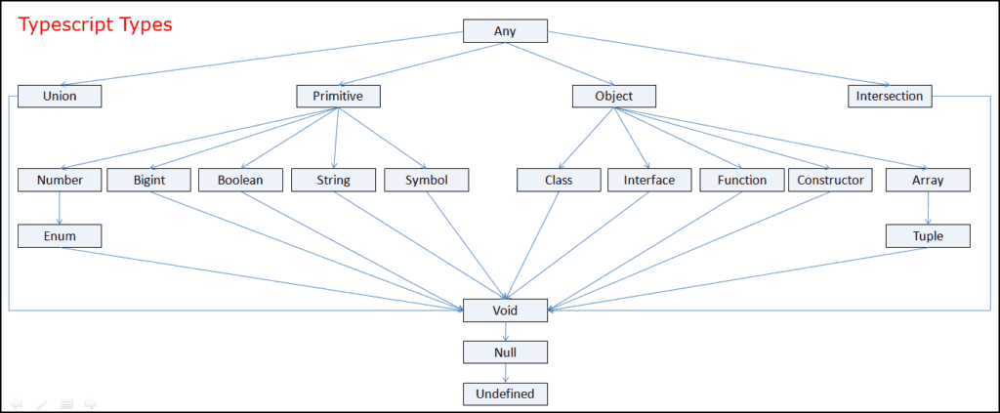

## Type System



A good rule of thumb is to let the TSC infer the type of your variable and avoid an explicit type definition.

### Any
This is the most generic type of data.

### Unknown
Used for the cases where one has a value whose type one does not know ahead of time, one should use unknown instead of any.

### Boolean

```typescript
let b = true
let b: true = true // (2) type literal definition
let b: false = true // (3) This would raise an error
```

in cases (2) and (3) we have defined the variable b to a specific type literal. A type literal is a type that represents a single value and nothing else.

### Number
Numbers can be floats, integers, positives, negatives, etc. When working with long numbers use numeric separators:

```typescript
let oneMillion = 1_000_000 // Use the numeric separators
let twoMillion: 2_000_000 = 2_000_000
```

### Bigint
Bigint are the analog of BigIntegers in Java. They seem to be pretty well suited for complex calculation where precision is necessary and rounding errors need to be handled in a specific way. 

This type of numbers are not supported by all javascript engines

### String
Not much to say about this.

### Symbol
Symbol is a relatively new language feature. They are used as an alternative to string key in objects and maps. 

```typescript
let a = Symbol('a')
let b: symbol = Symbol('b')
const e = Symbol('e') // This is inferred to be a unique symbol 
```

### Object

The object type is used to describe objects. An object is a bit narrower than `any` but it does not tell one much about the value it describes rather than the value is a javascript object.

```typescript
let h0: object = { b: 'value' }
console.log(h0.b) // (1) The property b does not exist on type object

let h: { b: string, c?: number, d: boolean } = {b: 'value', d: true}
console.log(h.b) // (2) it prints 'value'

let j: { [b: number]: string } = {10: 'ten'} // Object with index signature
let danger: Object = {} // The compiler complains about this because Object is a Javascript type. The TSlint suggests to use object instead
```

Case (1) would raise an error as the type of `h0` is `object` and `object` has no property by the name `b`. In general one should avoid the following types of syntax:

```typescript
let notgood = {}
let notgood = {x: 1}
let notgood: Object
let notgood: Object = {}
```

in favor of the following syntax:

```typescript
let ok: {x: number} = {x: 10} // When you know the shape of the object 
let ok: object // If you do not care which fields the object has
```

#### Type Aliases

Types can be aliased in the following way:

```typescript
type age = number

type Person = {
    name: string,
    age: age
}
```

different types of objects can be merged together:

```typescript
type Cat = {name: string, purrs: boolean}
type Dog = {name: string, barks: boolean, wags: boolean}
type CatOrDogOrBoth = Cat | Dog
type CatAndDog = Cat & Dog

// I can either define the cat properties
let cat: CatOrDogOrBoth = {
    name: 'sgnapsi',
    purrs: true
}

// I can either define the Dog properties
let dog: CatOrDogOrBoth = {
    name: 'doggy',
    purrs: false,
    barks: true
}

// This must define all the properties in Cat and Dog
let monster: CatAndDog = {
    barks: true,
    purrs: false,
    name: 'monster',
    wags: true
}
```

A nice usage of unions can be for instance when a function returns either a value or null, like for example:

```typescript
type MyType = string | null

function trueOrNull(isTrue: boolean): MyType {
    if(isTrue) {
        return 'true'
    }
    return null
}
```

### Arrays

```typescript
function addItemsToArray() {
    const values = [];
    values.push('text')
    values.push(true)
    return values
}

let array = addItemsToArray();
array.push(10); // A number cannot be assigned to a type 'string | boolean'. When the type is outside the scope it was defined into, typescript makes it final
```

##### Readonly Arrays:

```typescript
const notmodifyable: readonly number[] = [1, 2, 3];
console.log(notmodifyable)

// notmodifyable.push(6); // the property push does not exist on type readonly
console.log(notmodifyable.concat(6)) // A new instance is created here
```

### Tuples

Tuples are a natural extension of arrays and can contain several different object types:

```typescript
const singleton: [number] = [1]
const pair: [number, number] = [1, 2]
const triple: [number, number, number] = [1, 2, 3]
const tuple: [number, ...number[]] = [1, 2, 3, 4, 5] // n-elements tuple with one mandatory element

type Color = string
const colorPalette: [boolean, string, ...Color[]] = [true, 'Custom Color', '#FFFFFF']
```

### Unedfined, Null, Void and Never 

- `undefined` means that something has not been defined yet
- `null` means the absence of a value
- `void` is the type used by functions that do not retun any value
- `never` is the type used by functions that never returns at all (e.g. because of an error or because it is a function that runs forever)

```typescript
function doNotReturnAnything() {
    const localVar: number = 4
}

function neverEnding(): never {
    while (true) {
        doNotReturnAnything()
    }
}
```

### Enums

Enums can be defined to be mapping string to number or string to string.

```typescript
// Enum names are singular and Uppercase
// Here TSC infers the key indexes to be 0, 1, 2
enum ColorEnum {
    Red,
    Green,
    Blue
}

// I can also tell the TSC what number values I want my enum to have
enum LanguageEnum {
    Italian = 1,
    English = 5,
    German = 7
}

// Enums can also be merged together
enum BeverageEnum {
    Coffee = 0,
    Water = 1,
}
enum BeverageEnum {
    Tea = 2,
}
// In this case it is possible to access the enum via index, but the index is out of bound
console.log(BeverageEnum[6])

const enum ColorHexEnum {
    Red = '#fd024c',
    Green = '#02fdbf',
    Blue = '#022ffd'
}
console.log(ColorHexEnum[6]) // A const enum can only be accessed using the string literal
console.log(ColorHexEnum.Red)

const enum Cookable {
    Pasta,
    Pizza,
    Vegetables
}
function cookIt(cookable: Cookable) {
    console.log('Cooking: ' + cookable)
}
cookIt(Cookable.Pasta)
cookIt(25) // This is possible because we have defined the Cookable enum type to map numbers

const enum SaferCookable {
    Pasta = 'Pasta',
    Pizza = 'Pizza',
    Vegetables = 'Vegetables'
}
function cookItSafe(cookable: SaferCookable) {
    console.log('Cooking: ' + cookable)
}
cookItSafe(SaferCookable.Pasta)
cookItSafe(25) // It is not possible to call the function with a number as the enum maps string to string
```

## Advanced Types


